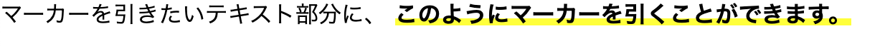

# Marker Animation

マーカーで文字をなぞるようなアニメーションを実装したサンプルです。

## デモ
https://y-programing.github.io/marker-animation/

## Preview

## 使用技術
- HTML
- CSS

## 機能
- マーカーアニメーション
- スクロール連動アニメーション

## 制作目的
フロントエンドのアニメーション表現を学習するために制作しました。

## 実装ポイント
CSSアニメーションを使い、文字にマーカーが引かれるような表現を実装しました。

background-image と linear-gradient を使用し、  
background-size をアニメーションさせることで  
マーカーが左から右へ引かれるような動きを作っています。